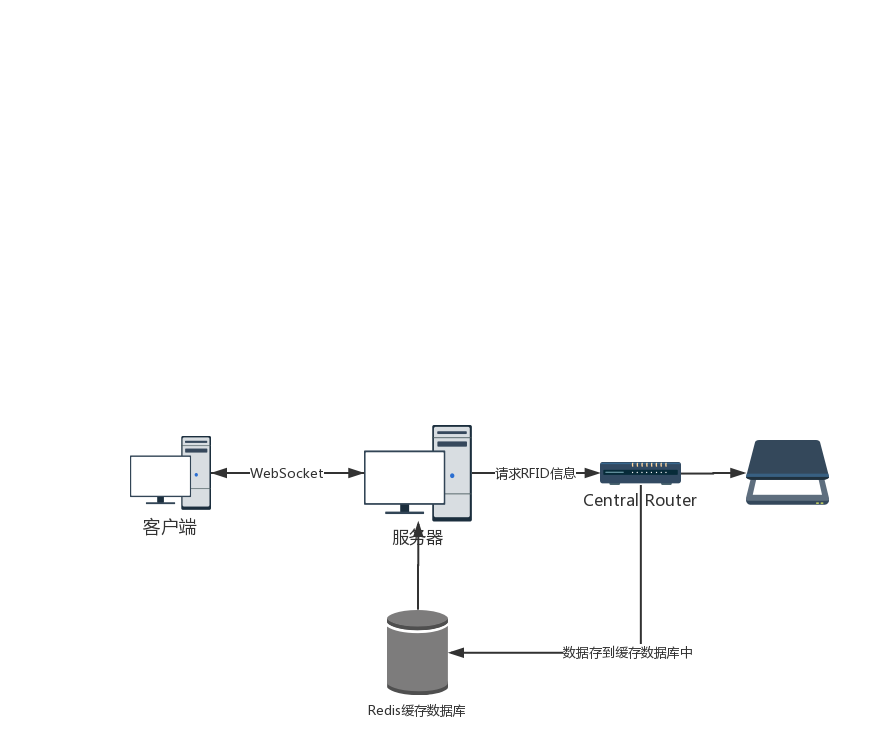

# OOCL_MQ

This repository is designed to offer a quick and simple solution for my company (OOCL) in a specific domain oriented scene.  

## 核心思路

在client和Router之间架设一台服务器, 这样服务器分别负责和client和Router进行通信, 其中client和服务器通信协议是websocket, 服务器和Router进行通信按照RFID文档进行通信. 以此来协调两者之间的信息交流.

## 为什么采用WebSocket通信?

和Shayne进行交流的时候, 以前的是采用轮询的通讯方式, 当操作人员在电脑上打开对应的界面想要获取RFID信息的时候, 就会触发轮询, 客户端按照一定的频率不断地向Router发送请求,来获取最新信息. 轮询的缺点就是非常浪费带宽, 效率也很低, 而且代码不是很好管理. 而WebSocket可以主动的将消息从服务器推动到客户端, 这样客户端需要写的东西就很少了.

## 通信的细节

### 客户端要做的地方

* 客户端和服务器之间采用全双工通讯协议(WebSocket)
  
* 客户端需要**重写connect的方法, 此时重写只需要连接上服务器就可以**,不过重写工作量很小, 采取websocket协议和服务器之间进行通讯
  
* 客户端在和服务器建立联系的时候, 需要将自己想要连接的AnteID发送过去

* 如果Router检测到任何新的RFID信息, 服务器会主动将RFID的TagID推送到客户端(WebSocket). 
  

### 服务器端要做的地方(**需要完成大多数的工作**)

* 服务器采用Spring Boot来处理客户端发送的请求, 返回消息的格式是: {String []: TagId}. **所以服务器端要开一个单独的Spring Boot的service.**  

* 服务器会单独开一个线程, 此线程会以一定的时间间隔发送请求到Router, 通过此方式来获取最新的RFID信息, 服务器需要对照这RFID文档重写connect方法. **所以服务器端需对照RFID文档重写connect,并对获取到的RFID进行加工**
  
* 服务器会将从Router中获取到的信息保存到对应的Redis缓存池中, Redis是一个"in-memory data structure store", 将从Router中拿到的信息有如下几个关键的key: AnteID, TagID, TimeStamp, 还可以设置一些过期时间, 是否已经推送出去等信息. **所以服务器要自己搭建Redis内存缓存库, 将封装好后的RFID信息存进去**

* 最后服务器推送消息, 服务器会根据之前建立联系的AnteID将对应的消息推送到与此AnteID相对应的客户端.

* 服务器端采用的语言是Java, Redis可以用封装好的Jedis, Jedis是spring boot的官方推荐