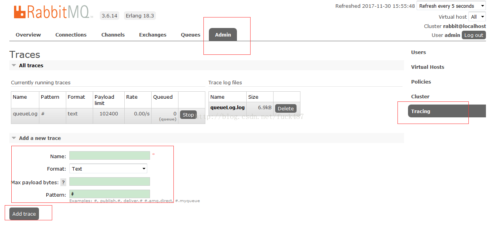
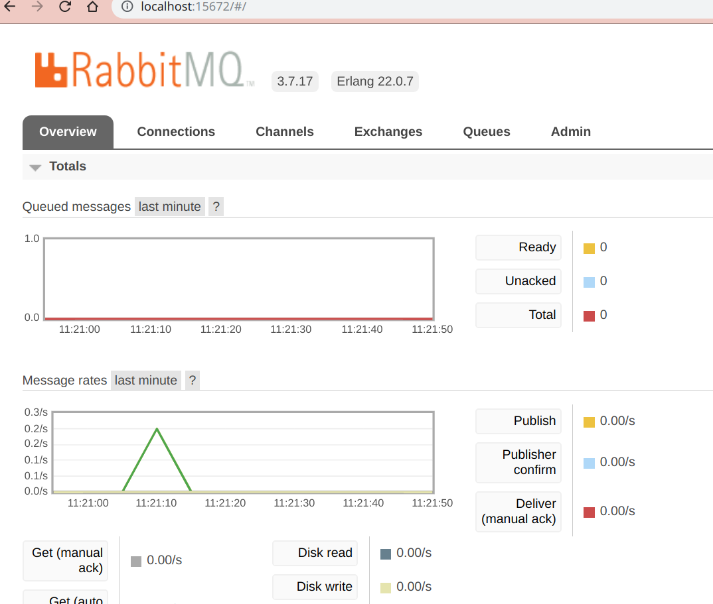

# OOCL_MQ

This repository is designed to offer a quick and simple solution for my company (OOCL) in a specific domain oriented scene.  

## Problem Description and solution

There is only one Central Scanner Router(CSR) in my company used for capturing the RFID(radio-frequency identification) information details on many antenna boards sequentially. And at the same time, there are about dozens of clients needed to communicate with the CSR to gain information about the RFID. The performance downside happens when there are multiple clients sending the request to the CSR simultaneously, then other clients will be blocked for seconds. Besides, the CSR will traverse all the antenna boards to gain the refreshed RFID information, which is trivial and time-consuming.
 
Below here is a chart of the processing procedure to use the Message Queue component to solve the problem:

## Why use RabbitMQ ?

### Comparison between serveral common message middleware

I make a research about the common message middlewares in the current market: RabbitMQ, ActiveMQ, RocketMQ and kaflaMQ. Actually, the difference between those middlewares in our business scenario is trivial. Their performance variation is not under our consideration, after all we have countable clients and machines. In our business model, we just need several functions for the MQ middleware :

* Extensive and comprehensive documentation for the developer to get start and dive into.
  
* Relatively friendly operation graphical interface for the administrator.
  
* Log can be stored easily and watched flexibly.

* Widely used by communities, therefore we can debug easily.

* Data durability can be customized flexibly, we can control the data persistence by ourself.

Based on those demands, I choose to use the RabbitMQ to be used in our business model. I make several tiny experiments on RabbitMQ using Docker, the result is that I can easily build a platform following the offical documentation in a considerably short time. The documentation is excellent, and besides, the graphic adminstration interface is friendly too.

My experiment results as shown below:

